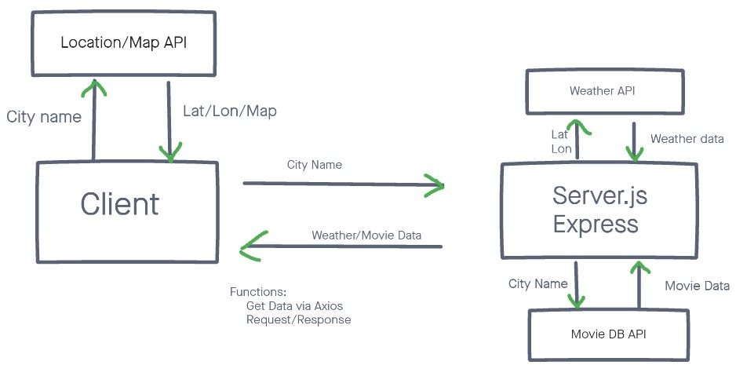

# City Explorer API

**Author**: Chris Rarig
**Version**: 1.0.0

*Live Link*: [https://chris-rarig-city-explorer.netlify.app](https://chris-rarig-city-explorer.netlify.app)
*GitHub*: [City-Explorer-API-Repo](https://github.com/chrisrarig1/city-explorer-api)
*Trello*: [Planning-Board](https://trello.com/b/yJ6s01tq/lab06)
*Heroku* [chris-r-city-explorer-server](https://chris-r-city-explorer-server.herokuapp.com/)

## Overview

- This application allows users to input and search for cities and receive specific information about that city such as coordinates and a map

## Getting Started
<!-- What are the steps that a user must take in order to build this app on their own machine and get it running? -->

## Architecture

- Languages: JavaScript, HTML, CSS
- Libraries: BootStrap and LocationIQ API

## Change Log

- 10-06-2021 10:05pm - Application now has a fully-functional input, with a GET route for the location data
- 10-06-2021 11:36pm - Application now has error handling and updated bootstrap format
- 10-11-2021 11:00pm - Pulled in weather data from Json file
- 10-12-2021 10:15pm - Added find function to generate weather
- 10-13-2021 11:30pm - Replaced Json with API and pulled both weather and movie data to frontend

## Credit and Collaborations

- WRRC Planning - Chris Reichert and Chris Rarig

## Feature Time Reports

1. *Name of feature*: Weather Data Pull

    - *Estimate of time needed to complete*: 2hrs

    - *Start time*: 10-10-2021 11:15am

    - *Finish time*: 10-10-2021 2:00pm

    - *Actual time needed to complete*: 2hr and 45mins

2. *Name of feature*: Weather population

    - *Estimate of time needed to complete*: 1hrs

    - *Start time*: 10-11-2021 8:30pm

    - *Finish time*: 10-11-2021 10:30pm

    - *Actual time needed to complete*: 2hrs

3. *Name of feature*: Bootstrap

    - *Estimate of time needed to complete*: 1hrs

    - *Start time*: 10-13-2021 2:00pm

    - *Finish time*: 10-13-2021 3:15pm

    - *Actual time needed to complete*: 1hr and 15mins

